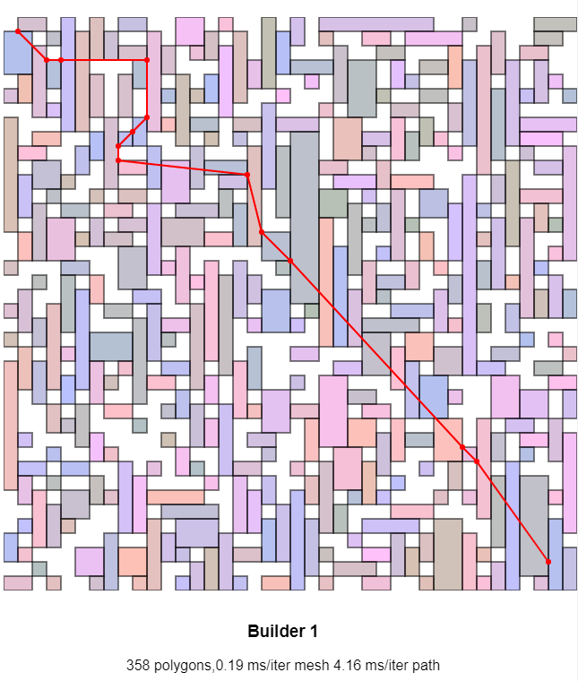
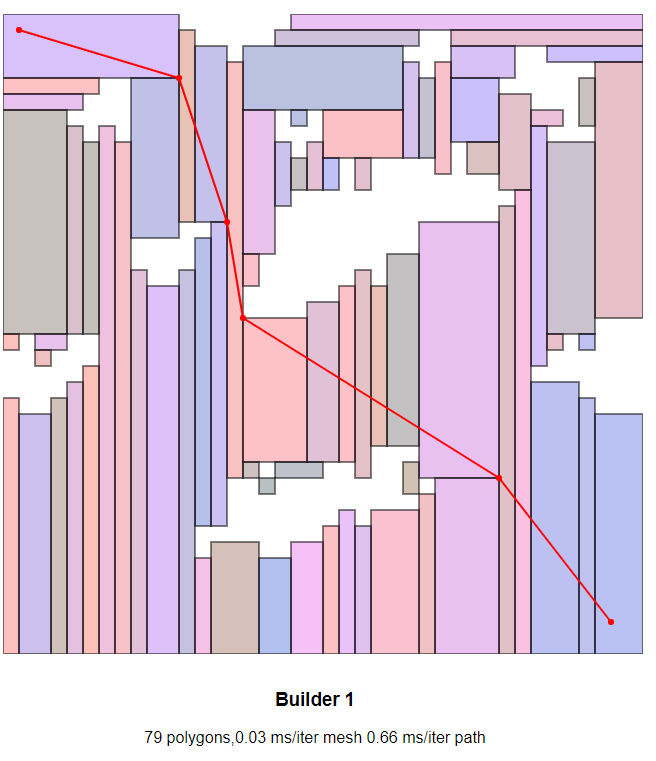

# 2d NavMesh Experiment

Trying out a couple of different approaches for building up
2D navmeshes from 2D grids. The objective is not necessarily
to get the "best" solution, but one that works in reasonable
time and with reasonable accuracy.

Open in Vercel (https://2d-navmesh-experiment.vercel.app/)
to try random maps or draw your own and see it update live.

The "best" navmesh algorithm is in `gridBuilder.ts`. The best
navmesh pathfinding solution I tested was (stability and performance)
was `"navmesh": "2.0.3"` a.k.a. https://github.com/mikewesthad/navmesh

NavMesh building on a 40x40 grid takes ~0.2ms. Pathfinding takes
1-5ms depending on the obstacle density.

This example is a 40x40 grid with obstacle density (set in `constants.ts`)
of 0.5

Here is a (quickly) hand drawn grid which may represent a more likely use case.

Created with CodeSandbox
